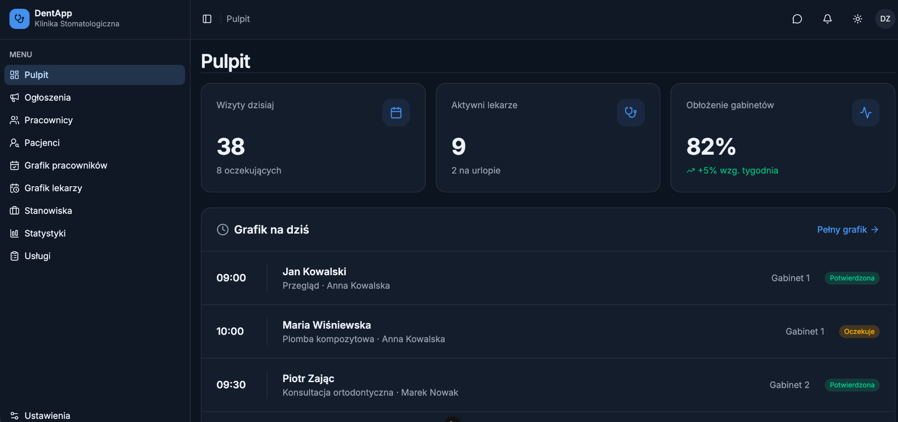
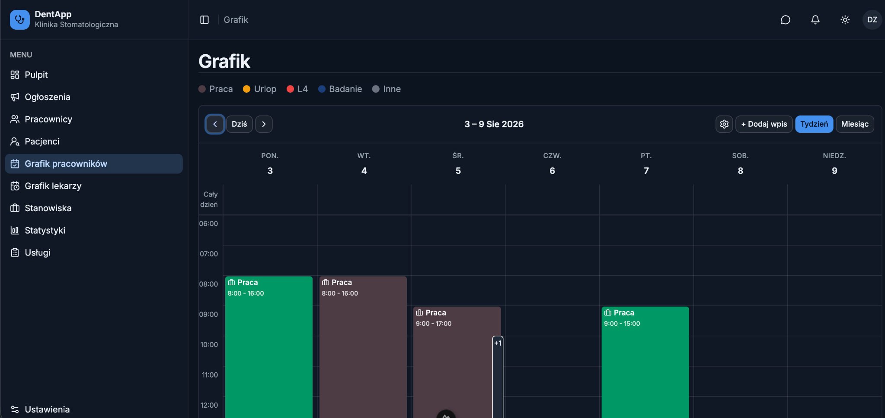
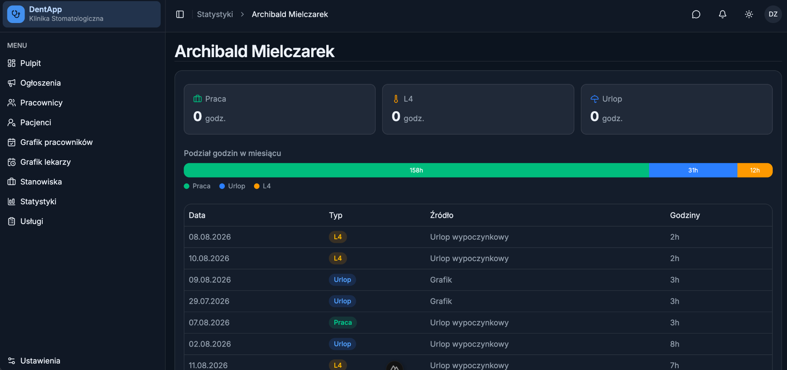
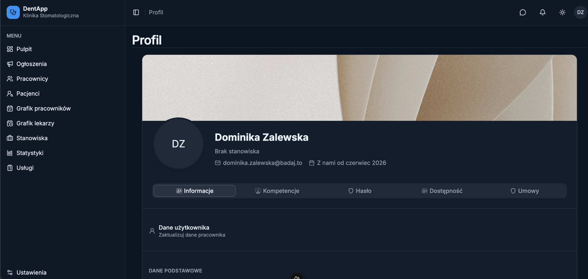
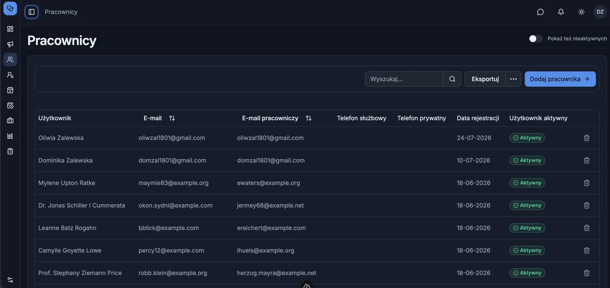

# DentApp

A web application for managing a dental clinic, focused on organizing employees, schedules, patients and clinic statistics.

## Tech Stack

* **Nuxt 3**
* **Vue 3**
* **TypeScript**
* **Tailwind CSS**
* **CI/CD**

## Overview

DentApp is a clinic management application designed to provide a clear and centralized interface for managing day-to-day clinic operations.

The application includes dedicated views for:

* Dashboard and key clinic metrics
* Employee schedules
* Doctor schedules
* Patient and employee management
* Employee profiles
* Clinic statistics
* Services and other administrative sections

## Screenshots

### Dashboard

The main dashboard provides an overview of the clinic, including today's appointments, active doctors, clinic utilization and the daily schedule.



### Employee Schedule

A weekly schedule view for organizing employee working hours, holidays and other types of schedule entries.



### Statistics

A statistics view presenting employee working time and its breakdown into work, holidays and leave.



### Employee Profile

A detailed employee profile containing personal information and dedicated sections for employee-related data.



### Data Table

Example of a structured data management view used within the application.



## Project Highlights

* Building reusable UI components with Vue 3 and Nuxt 3
* Type-safe development with TypeScript
* Responsive interface built with Tailwind CSS
* Dashboard-oriented UI for presenting operational data
* Complex schedule and calendar-based views
* End-to-end development from Figma designs to frontend implementation and testing
* CI/CD integration

## Project Structure

The project follows a modular frontend structure with reusable components and Nuxt 3 conventions.

## Development

Install dependencies:

```bash
npm install
```

Start the development server:

```bash
npm run dev
```

The application will be available at:

```text
http://localhost:3000
```

## Author

**Dominika Zalewska**

Fullstack Developer — PHP/Laravel, Vue 3/Nuxt 3, TypeScript

[GitHub](https://github.com/domizalewska)
